Mini Data-Analysis Deliverable 1
================

# Welcome to your (maybe) first-ever data analysis project!

And hopefully the first of many. Let’s get started:

1.  Install the [`datateachr`](https://github.com/UBC-MDS/datateachr)
    package by typing the following into your **R terminal**:

<!-- -->

    install.packages("devtools")
    devtools::install_github("UBC-MDS/datateachr")

2.  Load the packages below.

``` r
library(datateachr)
library(tidyverse)
```

    ## ── Attaching packages ─────────────────────────────────────── tidyverse 1.3.2 ──
    ## ✔ ggplot2 3.3.6      ✔ purrr   0.3.5 
    ## ✔ tibble  3.1.8      ✔ dplyr   1.0.10
    ## ✔ tidyr   1.2.1      ✔ stringr 1.4.1 
    ## ✔ readr   2.1.3      ✔ forcats 0.5.2 
    ## ── Conflicts ────────────────────────────────────────── tidyverse_conflicts() ──
    ## ✖ dplyr::filter() masks stats::filter()
    ## ✖ dplyr::lag()    masks stats::lag()

3.  Make a repository in the <https://github.com/stat545ubc-2022>
    Organization. You will be working with this repository for the
    entire data analysis project. You can either make it public, or make
    it private and add the TA’s and Lucy as collaborators. A link to
    help you create a private repository is available on the
    \#collaborative-project Slack channel.

# Instructions

## For Both Milestones

-   Each milestone is worth 45 points. The number of points allocated to
    each task will be annotated within each deliverable. Tasks that are
    more challenging will often be allocated more points.

-   10 points will be allocated to the reproducibility, cleanliness, and
    coherence of the overall analysis. While the two milestones will be
    submitted as independent deliverables, the analysis itself is a
    continuum - think of it as two chapters to a story. Each chapter, or
    in this case, portion of your analysis, should be easily followed
    through by someone unfamiliar with the content.
    [Here](https://swcarpentry.github.io/r-novice-inflammation/06-best-practices-R/)
    is a good resource for what constitutes “good code”. Learning good
    coding practices early in your career will save you hassle later on!

## For Milestone 1

**To complete this milestone**, edit [this very `.Rmd`
file](https://raw.githubusercontent.com/UBC-STAT/stat545.stat.ubc.ca/master/content/mini-project/mini-project-1.Rmd)
directly. Fill in the sections that are tagged with
`<!--- start your work below --->`.

**To submit this milestone**, make sure to knit this `.Rmd` file to an
`.md` file by changing the YAML output settings from
`output: html_document` to `output: github_document`. Commit and push
all of your work to the mini-analysis GitHub repository you made
earlier, and tag a release on GitHub. Then, submit a link to your tagged
release on canvas.

**Points**: This milestone is worth 45 points: 43 for your analysis, 1
point for having your Milestone 1 document knit error-free, and 1 point
for tagging your release on Github.

# Learning Objectives

By the end of this milestone, you should:

-   Become familiar with your dataset of choosing
-   Select 4 questions that you would like to answer with your data
-   Generate a reproducible and clear report using R Markdown
-   Become familiar with manipulating and summarizing your data in
    tibbles using `dplyr`, with a research question in mind.

# Task 1: Choose your favorite dataset (10 points)

The `datateachr` package by Hayley Boyce and Jordan Bourak currently
composed of 7 semi-tidy datasets for educational purposes. Here is a
brief description of each dataset:

-   *apt_buildings*: Acquired courtesy of The City of Toronto’s Open
    Data Portal. It currently has 3455 rows and 37 columns.

-   *building_permits*: Acquired courtesy of The City of Vancouver’s
    Open Data Portal. It currently has 20680 rows and 14 columns.

-   *cancer_sample*: Acquired courtesy of UCI Machine Learning
    Repository. It currently has 569 rows and 32 columns.

-   *flow_sample*: Acquired courtesy of The Government of Canada’s
    Historical Hydrometric Database. It currently has 218 rows and 7
    columns.

-   *parking_meters*: Acquired courtesy of The City of Vancouver’s Open
    Data Portal. It currently has 10032 rows and 22 columns.

-   *steam_games*: Acquired courtesy of Kaggle. It currently has 40833
    rows and 21 columns.

-   *vancouver_trees*: Acquired courtesy of The City of Vancouver’s Open
    Data Portal. It currently has 146611 rows and 20 columns.

**Things to keep in mind**

-   We hope that this project will serve as practice for carrying our
    your own *independent* data analysis. Remember to comment your code,
    be explicit about what you are doing, and write notes in this
    markdown document when you feel that context is required. As you
    advance in the project, prompts and hints to do this will be
    diminished - it’ll be up to you!

-   Before choosing a dataset, you should always keep in mind **your
    goal**, or in other ways, *what you wish to achieve with this data*.
    This mini data-analysis project focuses on *data wrangling*,
    *tidying*, and *visualization*. In short, it’s a way for you to get
    your feet wet with exploring data on your own.

And that is exactly the first thing that you will do!

1.1 Out of the 7 datasets available in the `datateachr` package, choose
**4** that appeal to you based on their description. Write your choices
below:

**Note**: We encourage you to use the ones in the `datateachr` package,
but if you have a dataset that you’d really like to use, you can include
it here. But, please check with a member of the teaching team to see
whether the dataset is of appropriate complexity. Also, include a
**brief** description of the dataset here to help the teaching team
understand your data.

<!-------------------------- Start your work below ---------------------------->

1: apt_buildings

2: cancer_sample

3: steam_games

4: vancouver_trees

<!----------------------------------------------------------------------------->

1.2 One way to narrowing down your selection is to *explore* the
datasets. Use your knowledge of dplyr to find out at least *3*
attributes about each of these datasets (an attribute is something such
as number of rows, variables, class type…). The goal here is to have an
idea of *what the data looks like*.

*Hint:* This is one of those times when you should think about the
cleanliness of your analysis. I added a single code chunk for you below,
but do you want to use more than one? Would you like to write more
comments outside of the code chunk?

<!-------------------------- Start your work below ---------------------------->

### *apt_buildings*

Acquired courtesy of The City of Toronto’s Open Data Portal. It
currently has 3455 rows and 37 columns.

``` r
### EXPLORE HERE ###
head(apt_buildings)
```

    ## # A tibble: 6 × 37
    ##      id air_co…¹ ameni…² balco…³ barri…⁴ bike_…⁵ exter…⁶ fire_…⁷ garba…⁸ heati…⁹
    ##   <dbl> <chr>    <chr>   <chr>   <chr>   <chr>   <chr>   <chr>   <chr>   <chr>  
    ## 1 10359 NONE     Outdoo… YES     YES     0 indo… NO      YES     YES     HOT WA…
    ## 2 10360 NONE     Outdoo… YES     NO      0 indo… NO      YES     YES     HOT WA…
    ## 3 10361 NONE     <NA>    YES     NO      Not Av… NO      YES     NO      HOT WA…
    ## 4 10362 NONE     <NA>    YES     YES     Not Av… YES     YES     NO      HOT WA…
    ## 5 10363 NONE     <NA>    NO      NO      12 ind… NO      YES     NO      HOT WA…
    ## 6 10364 NONE     <NA>    NO      NO      Not Av… <NA>    YES     NO      HOT WA…
    ## # … with 27 more variables: intercom <chr>, laundry_room <chr>,
    ## #   locker_or_storage_room <chr>, no_of_elevators <dbl>, parking_type <chr>,
    ## #   pets_allowed <chr>, prop_management_company_name <chr>,
    ## #   property_type <chr>, rsn <dbl>, separate_gas_meters <chr>,
    ## #   separate_hydro_meters <chr>, separate_water_meters <chr>,
    ## #   site_address <chr>, sprinkler_system <chr>, visitor_parking <chr>,
    ## #   ward <chr>, window_type <chr>, year_built <dbl>, year_registered <dbl>, …

### *cancer_sample*

Acquired courtesy of UCI Machine Learning Repository. It currently has
569 rows and 32 columns.

``` r
### EXPLORE HERE ###
head(cancer_sample)
```

    ## # A tibble: 6 × 32
    ##       ID diagn…¹ radiu…² textu…³ perim…⁴ area_…⁵ smoot…⁶ compa…⁷ conca…⁸ conca…⁹
    ##    <dbl> <chr>     <dbl>   <dbl>   <dbl>   <dbl>   <dbl>   <dbl>   <dbl>   <dbl>
    ## 1 8.42e5 M          18.0    10.4   123.    1001   0.118   0.278   0.300   0.147 
    ## 2 8.43e5 M          20.6    17.8   133.    1326   0.0847  0.0786  0.0869  0.0702
    ## 3 8.43e7 M          19.7    21.2   130     1203   0.110   0.160   0.197   0.128 
    ## 4 8.43e7 M          11.4    20.4    77.6    386.  0.142   0.284   0.241   0.105 
    ## 5 8.44e7 M          20.3    14.3   135.    1297   0.100   0.133   0.198   0.104 
    ## 6 8.44e5 M          12.4    15.7    82.6    477.  0.128   0.17    0.158   0.0809
    ## # … with 22 more variables: symmetry_mean <dbl>, fractal_dimension_mean <dbl>,
    ## #   radius_se <dbl>, texture_se <dbl>, perimeter_se <dbl>, area_se <dbl>,
    ## #   smoothness_se <dbl>, compactness_se <dbl>, concavity_se <dbl>,
    ## #   concave_points_se <dbl>, symmetry_se <dbl>, fractal_dimension_se <dbl>,
    ## #   radius_worst <dbl>, texture_worst <dbl>, perimeter_worst <dbl>,
    ## #   area_worst <dbl>, smoothness_worst <dbl>, compactness_worst <dbl>,
    ## #   concavity_worst <dbl>, concave_points_worst <dbl>, symmetry_worst <dbl>, …

### *building_permits*

Acquired courtesy of The City of Vancouver’s Open Data Portal. It
currently has 20680 rows and 14 columns.

``` r
### EXPLORE HERE ###
head(building_permits)
```

    ## # A tibble: 6 × 14
    ##   permit_nu…¹ issue_date proje…² type_…³ address proje…⁴ build…⁵ build…⁶ appli…⁷
    ##   <chr>       <date>       <dbl> <chr>   <chr>   <chr>   <chr>   <chr>   <chr>  
    ## 1 BP-2016-02… 2017-02-01       0 Salvag… 4378 W… <NA>    <NA>     <NA>   Raffae…
    ## 2 BU468090    2017-02-01       0 New Bu… 1111 R… <NA>    <NA>     <NA>   MAX KE…
    ## 3 DB-2016-04… 2017-02-01   35000 Additi… 3732 W… <NA>    <NA>     <NA>   Peter …
    ## 4 DB-2017-00… 2017-02-01   15000 Additi… 88 W P… <NA>    Mercur… "88 W … Aaron …
    ## 5 DB452250    2017-02-01  181178 New Bu… 492 E … <NA>    082016… "3559 … John H…
    ## 6 BP-2016-01… 2017-02-02       0 Salvag… 3332 W… <NA>    <NA>     <NA>   Shalin…
    ## # … with 5 more variables: applicant_address <chr>, property_use <chr>,
    ## #   specific_use_category <chr>, year <dbl>, bi_id <dbl>, and abbreviated
    ## #   variable names ¹​permit_number, ²​project_value, ³​type_of_work,
    ## #   ⁴​project_description, ⁵​building_contractor, ⁶​building_contractor_address,
    ## #   ⁷​applicant

### *steam_games*

Acquired courtesy of Kaggle. It currently has 40833 rows and 21 columns.

``` r
### EXPLORE HERE ###
head(steam_games)
```

    ## # A tibble: 6 × 21
    ##      id url          types name  desc_…¹ recen…² all_r…³ relea…⁴ devel…⁵ publi…⁶
    ##   <dbl> <chr>        <chr> <chr> <chr>   <chr>   <chr>   <chr>   <chr>   <chr>  
    ## 1     1 https://sto… app   DOOM  Now in… Very P… Very P… May 12… id Sof… Bethes…
    ## 2     2 https://sto… app   PLAY… PLAYER… Mixed,… Mixed,… Dec 21… PUBG C… PUBG C…
    ## 3     3 https://sto… app   BATT… Take c… Mixed,… Mostly… Apr 24… Harebr… Parado…
    ## 4     4 https://sto… app   DayZ  The po… Mixed,… Mixed,… Dec 13… Bohemi… Bohemi…
    ## 5     5 https://sto… app   EVE … EVE On… Mixed,… Mostly… May 6,… CCP     CCP,CCP
    ## 6     6 https://sto… bund… Gran… Grand … NaN     NaN     NaN     Rockst… Rockst…
    ## # … with 11 more variables: popular_tags <chr>, game_details <chr>,
    ## #   languages <chr>, achievements <dbl>, genre <chr>, game_description <chr>,
    ## #   mature_content <chr>, minimum_requirements <chr>,
    ## #   recommended_requirements <chr>, original_price <dbl>, discount_price <dbl>,
    ## #   and abbreviated variable names ¹​desc_snippet, ²​recent_reviews,
    ## #   ³​all_reviews, ⁴​release_date, ⁵​developer, ⁶​publisher

### *vancouver_trees*

Acquired courtesy of The City of Vancouver’s Open Data Portal. It
currently has 146611 rows and 20 columns.

``` r
### EXPLORE HERE ###
head(vancouver_trees)
```

    ## # A tibble: 6 × 20
    ##   tree_id civic_number std_str…¹ genus…² speci…³ culti…⁴ commo…⁵ assig…⁶ root_…⁷
    ##     <dbl>        <dbl> <chr>     <chr>   <chr>   <chr>   <chr>   <chr>   <chr>  
    ## 1  149556          494 W 58TH AV ULMUS   AMERIC… BRANDON BRANDO… N       N      
    ## 2  149563          450 W 58TH AV ZELKOVA SERRATA <NA>    JAPANE… N       N      
    ## 3  149579         4994 WINDSOR … STYRAX  JAPONI… <NA>    JAPANE… N       N      
    ## 4  149590          858 E 39TH AV FRAXIN… AMERIC… AUTUMN… AUTUMN… Y       N      
    ## 5  149604         5032 WINDSOR … ACER    CAMPES… <NA>    HEDGE … N       N      
    ## 6  149616          585 W 61ST AV PYRUS   CALLER… CHANTI… CHANTI… N       N      
    ## # … with 11 more variables: plant_area <chr>, on_street_block <dbl>,
    ## #   on_street <chr>, neighbourhood_name <chr>, street_side_name <chr>,
    ## #   height_range_id <dbl>, diameter <dbl>, curb <chr>, date_planted <date>,
    ## #   longitude <dbl>, latitude <dbl>, and abbreviated variable names
    ## #   ¹​std_street, ²​genus_name, ³​species_name, ⁴​cultivar_name, ⁵​common_name,
    ## #   ⁶​assigned, ⁷​root_barrier

<!----------------------------------------------------------------------------->

1.3 Now that you’ve explored the 4 datasets that you were initially most
interested in, let’s narrow it down to 2. What lead you to choose these
2? Briefly explain your choices below, and feel free to include any code
in your explanation.

<!-------------------------- Start your work below ---------------------------->

1: *building_permits*

2: *vancouver_trees*

The reason why I want to choose these 2 is, they have both categorical
and numerical data. And their dimensions is relatively large,
*building_permits* with dimensions of

``` r
dim(building_permits)
```

    ## [1] 20680    14

*vancouver_trees* with dimensions of

``` r
dim(vancouver_trees)
```

    ## [1] 146611     20

<!----------------------------------------------------------------------------->

1.4 Time for the final decision! Going back to the beginning, it’s
important to have an *end goal* in mind. For example, if I had chosen
the `titanic` dataset for my project, I might’ve wanted to explore the
relationship between survival and other variables. Try to think of 1
research question that you would want to answer with each dataset. Note
them down below, and make your final choice based on what seems more
interesting to you!

<!-------------------------- Start your work below ---------------------------->

My final decision is:

**1: vancouver_trees**

**reasoning**: *vancouver_trees* dataset has very rich amounts and types
of variables. In general, there are at least 4 types of variable,
including geographical info, tree’s categorical info, tree’s numerical
info (size), and time info. So we can combine any two of the variables
to discuss the relationship between them.

For example, one research question I can think of is:

1: The relationship between tree’s planted time and tree’s category. Is
there a trend?

<!----------------------------------------------------------------------------->

# Important note

Read Tasks 2 and 3 *fully* before starting to complete either of them.
Probably also a good point to grab a coffee to get ready for the fun
part!

This project is semi-guided, but meant to be *independent*. For this
reason, you will complete tasks 2 and 3 below (under the **START HERE**
mark) as if you were writing your own exploratory data analysis report,
and this guidance never existed! Feel free to add a brief introduction
section to your project, format the document with markdown syntax as you
deem appropriate, and structure the analysis as you deem appropriate.
Remember, marks will be awarded for completion of the 4 tasks, but 10
points of the whole project are allocated to a reproducible and clean
analysis. If you feel lost, you can find a sample data analysis
[here](https://www.kaggle.com/headsortails/tidy-titarnic) to have a
better idea. However, bear in mind that it is **just an example** and
you will not be required to have that level of complexity in your
project.

# Task 2: Exploring your dataset (15 points)

If we rewind and go back to the learning objectives, you’ll see that by
the end of this deliverable, you should have formulated *4* research
questions about your data that you may want to answer during your
project. However, it may be handy to do some more exploration on your
dataset of choice before creating these questions - by looking at the
data, you may get more ideas. **Before you start this task, read all
instructions carefully until you reach START HERE under Task 3**.

2.1 Complete *4 out of the following 8 exercises* to dive deeper into
your data. All datasets are different and therefore, not all of these
tasks may make sense for your data - which is why you should only answer
*4*. Use *dplyr* and *ggplot*.

1.  Plot the distribution of a numeric variable.
2.  Create a new variable based on other variables in your data (only if
    it makes sense)
3.  Investigate how many missing values there are per variable. Can you
    find a way to plot this?
4.  Explore the relationship between 2 variables in a plot.
5.  Filter observations in your data according to your own criteria.
    Think of what you’d like to explore - again, if this was the
    `titanic` dataset, I may want to narrow my search down to passengers
    born in a particular year…
6.  Use a boxplot to look at the frequency of different observations
    within a single variable. You can do this for more than one variable
    if you wish!
7.  Make a new tibble with a subset of your data, with variables and
    observations that you are interested in exploring.
8.  Use a density plot to explore any of your variables (that are
    suitable for this type of plot).

<!-------------------------- Start your work below ---------------------------->

Question 1. Plot the distribution of a numeric variable. The only
numeric variable in this data set is **diameter** and
**height_range_id**

Distribution of **diameter**

``` r
answer2.1.1 <- vancouver_trees %>%
    ggplot(aes(diameter)) +
   geom_histogram(binwidth = 10)
print(answer2.1.1)
```

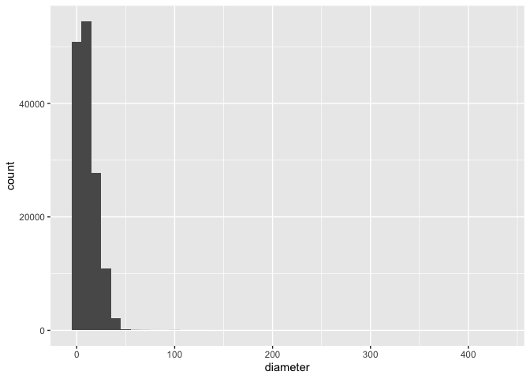<!-- -->

As we can see, the *diameter* ranges \[0, 400\], with most of its value
are within \[0, 50\]

Distribution of **height_range_id**

``` r
answer2.1.2 <- vancouver_trees %>%
    ggplot(aes(height_range_id)) +
    geom_histogram(binwidth = 1)
print(answer2.1.2)
```

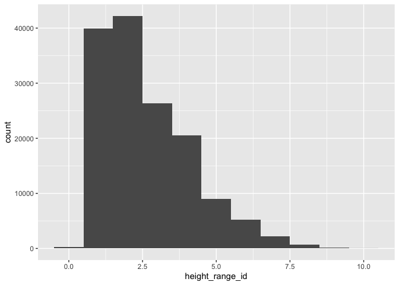<!-- -->

As we can see, the *height_range_id* ranges\[0, 10\]. The height group
with most counts is group 1 and group 2.

Question 3. Investigate how many missing values there are per variable.
Can you find a way to plot this?

``` r
answer2.3.1 <- vancouver_trees  %>%
    summarise_all(list(~is.na(.))) %>%
    pivot_longer(everything(),
               names_to = "variables", values_to="missing") %>%
    count(variables, missing) %>%
    ggplot(aes(y=variables,x=n,fill=missing))+
    geom_col()
print(answer2.3.1)
```

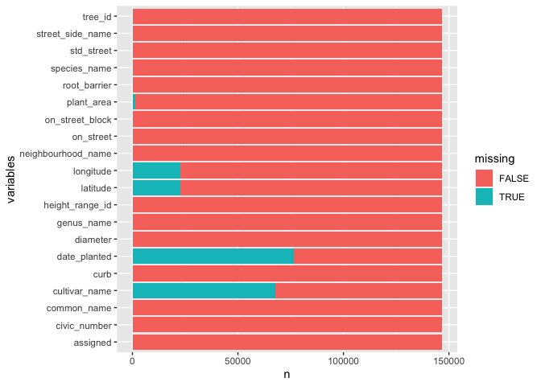<!-- -->

As we notice here, only *longitude*, *latitude*, *date_planted* and
*cultivar_name* have missing values. Specifically, for *date_planted*
and *cultivar_name*, its missing value’s counts exceeds 50% of its total
counts.

Question 2. Create a new variable based on other variables in your data
(only if it makes sense)

Combining with some knowledge in forestry, I had an intuition that
*genus_name*, *species_name* and *cultivar_name* could be concated
together to form a variable to distinguish tree’s category. However,
through the misssing values analysis above, we know that
*cultivar_name*’s missing value counts exceeds 50%. So, I decided to
concate only *genus_name* and *species_name*.

``` r
answer2.2.1 <- vancouver_trees %>%
    mutate(genus_species=paste(genus_name,species_name,sep="_")) %>%
    select(tree_id:species_name,genus_species, cultivar_name:latitude)
head(answer2.2.1)
```

    ## # A tibble: 6 × 21
    ##   tree_id civic_number std_str…¹ genus…² speci…³ genus…⁴ culti…⁵ commo…⁶ assig…⁷
    ##     <dbl>        <dbl> <chr>     <chr>   <chr>   <chr>   <chr>   <chr>   <chr>  
    ## 1  149556          494 W 58TH AV ULMUS   AMERIC… ULMUS_… BRANDON BRANDO… N      
    ## 2  149563          450 W 58TH AV ZELKOVA SERRATA ZELKOV… <NA>    JAPANE… N      
    ## 3  149579         4994 WINDSOR … STYRAX  JAPONI… STYRAX… <NA>    JAPANE… N      
    ## 4  149590          858 E 39TH AV FRAXIN… AMERIC… FRAXIN… AUTUMN… AUTUMN… Y      
    ## 5  149604         5032 WINDSOR … ACER    CAMPES… ACER_C… <NA>    HEDGE … N      
    ## 6  149616          585 W 61ST AV PYRUS   CALLER… PYRUS_… CHANTI… CHANTI… N      
    ## # … with 12 more variables: root_barrier <chr>, plant_area <chr>,
    ## #   on_street_block <dbl>, on_street <chr>, neighbourhood_name <chr>,
    ## #   street_side_name <chr>, height_range_id <dbl>, diameter <dbl>, curb <chr>,
    ## #   date_planted <date>, longitude <dbl>, latitude <dbl>, and abbreviated
    ## #   variable names ¹​std_street, ²​genus_name, ³​species_name, ⁴​genus_species,
    ## #   ⁵​cultivar_name, ⁶​common_name, ⁷​assigned

As you can see, the new column *genus_species* is after *genus_name* and
*species_name* and before *cultivar_name*

Question 7. Make a new tibble with a subset of your data, with variables
and observations that you are interested in exploring.

After exploring each column, I decided to drop
*civic_number*,*std_street*, *longitude*, *latitude*. because for the
geo info, we have *neighbourhood_name*, *on_street* etc to determine its
actual physical location.

``` r
vancouver_trees_sub <- answer2.2.1 %>%
    select(tree_id,genus_name:date_planted)
head(vancouver_trees_sub)
```

    ## # A tibble: 6 × 17
    ##   tree_id genus_name species_n…¹ genus…² culti…³ commo…⁴ assig…⁵ root_…⁶ plant…⁷
    ##     <dbl> <chr>      <chr>       <chr>   <chr>   <chr>   <chr>   <chr>   <chr>  
    ## 1  149556 ULMUS      AMERICANA   ULMUS_… BRANDON BRANDO… N       N       N      
    ## 2  149563 ZELKOVA    SERRATA     ZELKOV… <NA>    JAPANE… N       N       N      
    ## 3  149579 STYRAX     JAPONICA    STYRAX… <NA>    JAPANE… N       N       4      
    ## 4  149590 FRAXINUS   AMERICANA   FRAXIN… AUTUMN… AUTUMN… Y       N       4      
    ## 5  149604 ACER       CAMPESTRE   ACER_C… <NA>    HEDGE … N       N       4      
    ## 6  149616 PYRUS      CALLERYANA  PYRUS_… CHANTI… CHANTI… N       N       B      
    ## # … with 8 more variables: on_street_block <dbl>, on_street <chr>,
    ## #   neighbourhood_name <chr>, street_side_name <chr>, height_range_id <dbl>,
    ## #   diameter <dbl>, curb <chr>, date_planted <date>, and abbreviated variable
    ## #   names ¹​species_name, ²​genus_species, ³​cultivar_name, ⁴​common_name,
    ## #   ⁵​assigned, ⁶​root_barrier, ⁷​plant_area

Question 4. Explore the relationship between 2 variables in a plot.

Question 6. Use a boxplot to look at the frequency of different
observations within a single variable. You can do this for more than one
variable if you wish!

Combining question 4 and question 6 above, I created several boxplots as
below to see relationship between variables.

**diameter** X **neighbourhood_name**

``` r
answer2.6.1 <- ggplot(vancouver_trees_sub, aes(diameter, neighbourhood_name)) + 
    geom_boxplot(width = 0.8)
print(answer2.6.1)
```

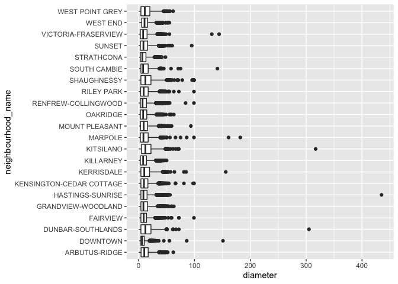<!-- -->

**height_range_id** X **neighbourhood_name**

``` r
answer2.6.2 <- ggplot(vancouver_trees_sub, aes(height_range_id, neighbourhood_name)) + 
    geom_boxplot(width = 0.8)
print(answer2.6.2)
```

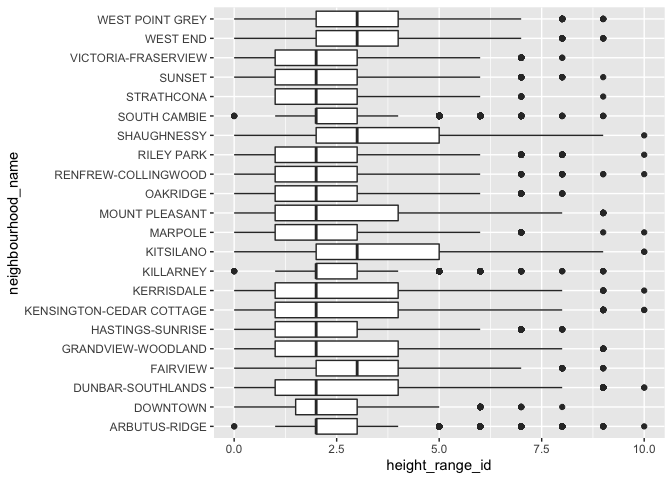<!-- -->

**genus_name** X **diameter**

``` r
answer2.6.3 <- ggplot(vancouver_trees_sub, aes(diameter, genus_name)) + 
    geom_boxplot(width = 0.8)
print(answer2.6.3)
```

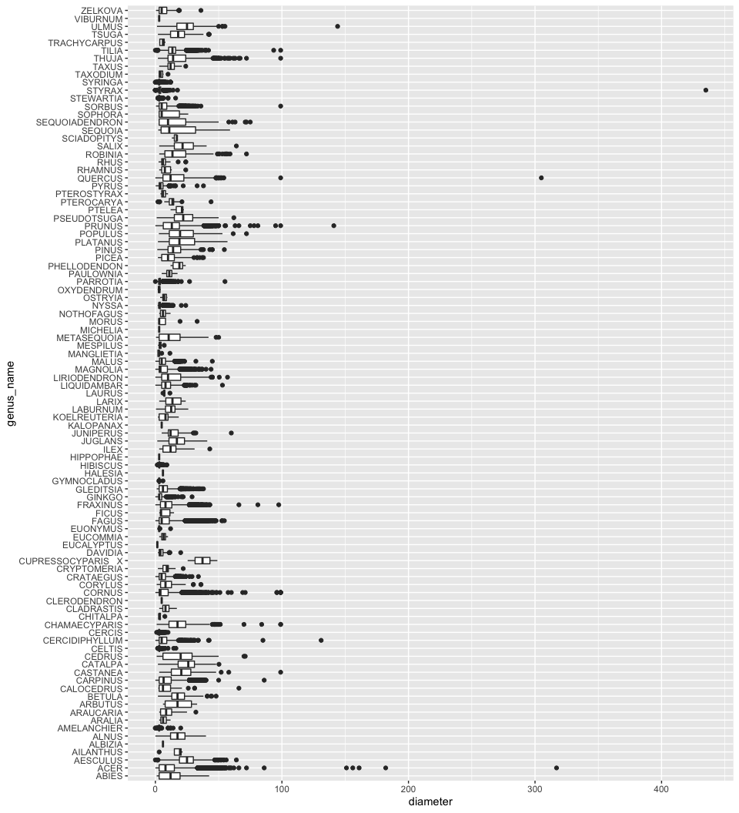<!-- -->

**genus_name** X **height_range_id**

``` r
answer2.6.4 <- ggplot(vancouver_trees_sub, aes(height_range_id, genus_name)) + 
    geom_boxplot(width = 0.8)
print(answer2.6.4)
```

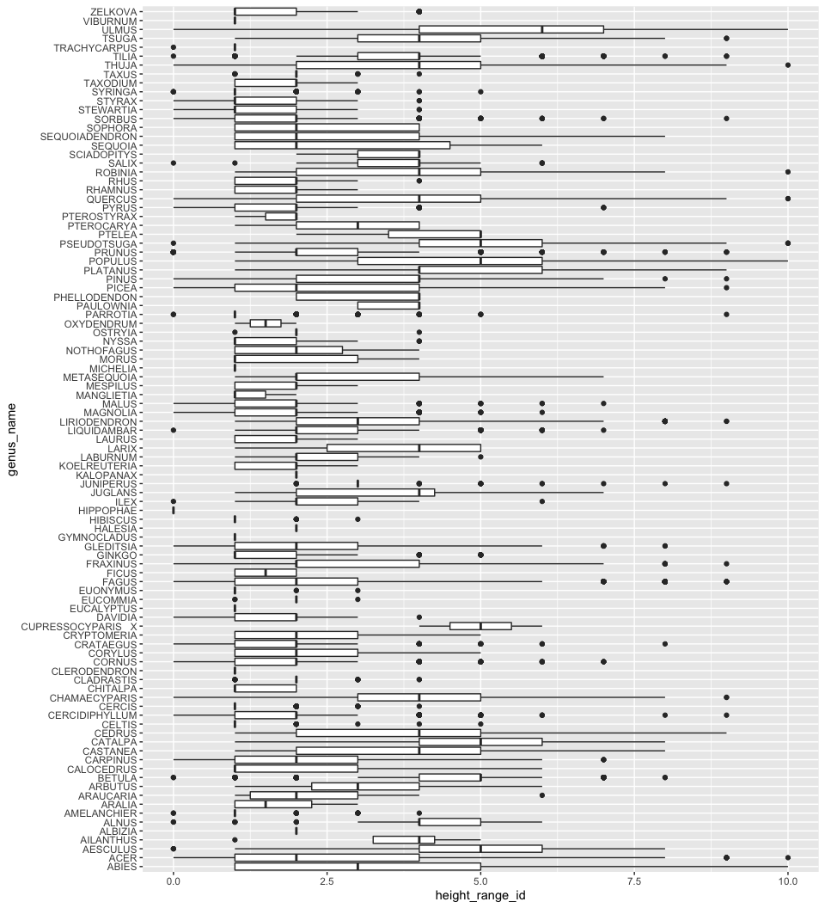<!-- -->

As we can see above, **genus_name** as tree’s category is more relevant
to tree’s size (diameter and height_range_id)

<!----------------------------------------------------------------------------->

# Task 3: Write your research questions (5 points)

So far, you have chosen a dataset and gotten familiar with it through
exploring the data. Now it’s time to figure out 4 research questions
that you would like to answer with your data! Write the 4 questions and
any additional comments at the end of this deliverable. These questions
are not necessarily set in stone - TAs will review them and give you
feedback; therefore, you may choose to pursue them as they are for the
rest of the project, or make modifications!

<!--- *****START HERE***** --->

Based on the observation above, I defined 4 research questions as below:

1.  Will the number of count of planted trees change by time?

2.  What’s the relationship between the year/month we planted the trees
    and its tree’s height? Is there any trend by time?

3.  What’s the relationship between the neighbourhood and its tree’s
    size (height and diameter)? Is there any pattern, such as some
    neighbourhood prefer planting bigger or taller trees?

4.  What’s the possible factor that contributes to the **curb**
    variable?

# Task 4: Process and summarize your data (13 points)

From Task 2, you should have an idea of the basic structure of your
dataset (e.g. number of rows and columns, class types, etc.). Here, we
will start investigating your data more in-depth using various data
manipulation functions.

### 1.1 (10 points)

Now, for each of your four research questions, choose one task from
options 1-4 (summarizing), and one other task from 4-8 (graphing). You
should have 2 tasks done for each research question (8 total). Make sure
it makes sense to do them! (e.g. don’t use a numerical variables for a
task that needs a categorical variable.). Comment on why each task helps
(or doesn’t!) answer the corresponding research question.

Ensure that the output of each operation is printed!

**Summarizing:**

1.  Compute the *range*, *mean*, and *two other summary statistics* of
    **one numerical variable** across the groups of **one categorical
    variable** from your data.
2.  Compute the number of observations for at least one of your
    categorical variables. Do not use the function `table()`!
3.  Create a categorical variable with 3 or more groups from an existing
    numerical variable. You can use this new variable in the other
    tasks! *An example: age in years into “child, teen, adult, senior”.*
4.  Based on two categorical variables, calculate two summary statistics
    of your choosing.

**Graphing:**

5.  Create a graph out of summarized variables that has at least two
    geom layers.
6.  Create a graph of your choosing, make one of the axes logarithmic,
    and format the axes labels so that they are “pretty” or easier to
    read.
7.  Make a graph where it makes sense to customize the alpha
    transparency.
8.  Create 3 histograms out of summarized variables, with each histogram
    having different sized bins. Pick the “best” one and explain why it
    is the best.

Make sure it’s clear what research question you are doing each operation
for!

<!------------------------- Start your work below ----------------------------->

#### Research Question 1. Will the number of count of planted trees change by time?

First, in order to make the time variable *date_planted* more easier to
be plotted and summarized, I separated it to *month* and *year*
variable.

lubricate library is introduced here to make the date format
transformation easier.

``` r
library(lubridate, warn.conflicts = FALSE)
```

``` r
vancouver_trees_time <- vancouver_trees_sub  %>%
                        mutate(month = floor_date(date_planted, unit="month")) %>%
                        mutate(year = format(as.Date(date_planted), "%Y"))%>%
                        drop_na(month)
head(select(vancouver_trees_time, c("date_planted", "year", "month")))
```

    ## # A tibble: 6 × 3
    ##   date_planted year  month     
    ##   <date>       <chr> <date>    
    ## 1 1999-01-13   1999  1999-01-01
    ## 2 1996-05-31   1996  1996-05-01
    ## 3 1993-11-22   1993  1993-11-01
    ## 4 1996-04-29   1996  1996-04-01
    ## 5 1993-12-17   1993  1993-12-01
    ## 6 1993-12-16   1993  1993-12-01

##### Summarizing: Compute the number of observations for at least one of your categorical variables.

``` r
vancouver_trees_month_count <- vancouver_trees_time %>% 
  group_by(month) %>% 
  summarise(tree_count = n())
head(vancouver_trees_month_count, n = 15)
```

    ## # A tibble: 15 × 2
    ##    month      tree_count
    ##    <date>          <int>
    ##  1 1989-10-01         23
    ##  2 1989-11-01        267
    ##  3 1989-12-01         10
    ##  4 1990-01-01         88
    ##  5 1990-02-01        135
    ##  6 1990-03-01        298
    ##  7 1990-04-01          3
    ##  8 1990-09-01          1
    ##  9 1990-11-01        485
    ## 10 1990-12-01        135
    ## 11 1991-01-01         15
    ## 12 1991-02-01        142
    ## 13 1991-03-01         56
    ## 14 1991-04-01         12
    ## 15 1991-05-01          1

To get the time trend of tree planted count, we can compute its number
of observations for time variable. And I noticed that it seems like
there is a cyclic trend of the tree planted count (the number goes up
and down) , which we might explore more when we plot the chart.

##### Graphing: Create a graph out of summarized variables that has at least two geom layers.

``` r
vancouver_trees_month_count_plot <- vancouver_trees_time %>% 
                                    filter(month > '2015-01-01') %>% 
                                    ggplot() +
                                #     geom_bar() + 
                                    geom_line(aes( x = month), stat="bin", binwidth=1) + 
                                    scale_x_date(NULL, date_labels = "%m-%Y", breaks = "month") +
                                    coord_flip()
print(vancouver_trees_month_count_plot)
```

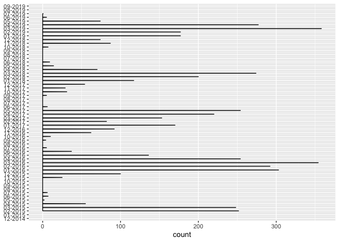<!-- -->

The graph reflects the relationship between date and tree planted count.
From the graph above, we noticed that there is a cyclic pattern of the
tree planted count by month. And 1 cycle is roughly 1 year.
Specifically, the month with larger tree planted count coincides with
springtime (March to May). While during the winter month (Nov. to Feb.),
people tends to plant less. This findings conform to our common sense.

#### Research Question 2. What’s the relationship between the year/month we planted the trees and its tree’s height? Is there any trend by time?

##### Summarizing: Compute the *range*, *mean*, and *two other summary statistics* of **one numerical variable** across the groups of **one categorical variable** from your data.

*height_range_id* is an integer variable, with its definition of 0-10
for every 10 feet (e.g., 0 = 0-10 ft). So it’s more like a catergorical
value. To evaluate the relationship between time and tree’s height, I
calculated the **mean** of *height_range_id* across *year*.

``` r
vancouver_trees_year_height <- vancouver_trees_time %>%
                              group_by(year) %>%
                              summarise(height_range_id_mean = mean(height_range_id, na.rm = TRUE))
head(vancouver_trees_year_height, n = 40)
```

    ## # A tibble: 31 × 2
    ##    year  height_range_id_mean
    ##    <chr>                <dbl>
    ##  1 1989                  2.51
    ##  2 1990                  2.50
    ##  3 1991                  2.68
    ##  4 1992                  3.00
    ##  5 1993                  2.57
    ##  6 1994                  2.40
    ##  7 1995                  2.34
    ##  8 1996                  2.37
    ##  9 1997                  2.35
    ## 10 1998                  2.43
    ## # … with 21 more rows

we noticed that, the average of tree’s height decreases year by year

##### Graphing: Create a graph of your choosing, make one of the axes logarithmic, and format the axes labels so that they are “pretty” or easier to read.

First, I transformed the data type of *year* and *height_range_id*, to
make plotting easier

``` r
vancouver_trees_time$height_range_id <- as.character(as.numeric(vancouver_trees_time$height_range_id))
vancouver_trees_time$year <- as.numeric(as.character(vancouver_trees_time$year))
```

``` r
vancouver_trees_time_height_plot <- vancouver_trees_time %>% 
    ggplot(aes(x = year)) + 
    geom_line(aes(color = height_range_id),stat="bin",binwidth=1) 
print(vancouver_trees_time_height_plot)
```

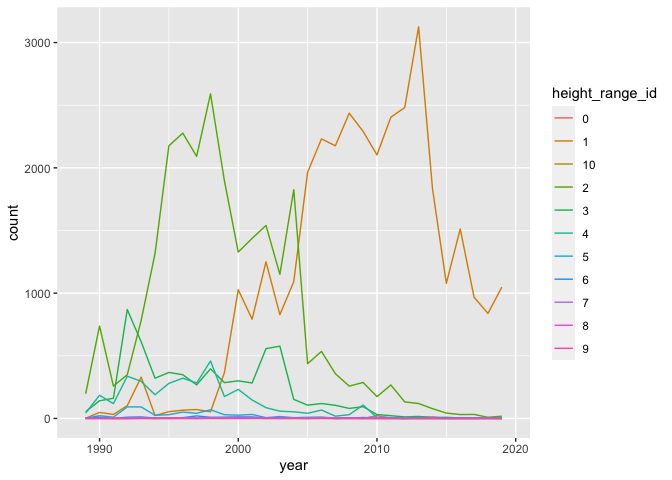<!-- -->

The above graph describe the relationship between *year* and
*planted_tree_count*, colored by *height_range_id*. Noticed that the
*planted_tree_count* varies a lot, it’s harder to distinguish the trend
of smaller values. So I decided to apply log to *count*

``` r
vancouver_trees_time_height_plot <- vancouver_trees_time %>% 
    ggplot(aes(x = year)) + 
    geom_line(aes(color = height_range_id),stat="bin",binwidth=1) +
    scale_y_continuous(trans='log2')
print(vancouver_trees_time_height_plot)
```

    ## Warning: Transformation introduced infinite values in continuous y-axis

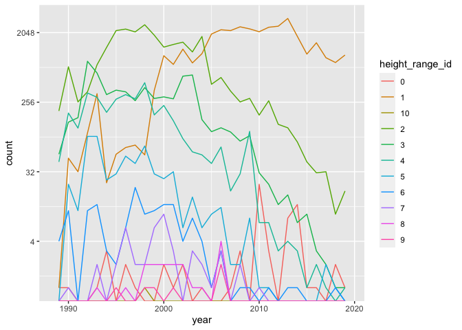<!-- -->

From the plot, we can determine that the tree’s count of some smaller
*height_range_id*, such as 0, 1 increases, and the larger ones, such as
2 - 6 decreases over the year. So, we can concludes that, people tend to
plant shorter tree in the recent 10 years.

#### Research Question 3. What’s the relationship between the neighbourhood and its tree’s size (height and diameter)? Is there any pattern, such as some neighbourhood prefer planting bigger or taller trees?

##### Summarizing: Create a categorical variable with 3 or more groups from an existing numerical variable.

Since height has been transformed to categorical variable, we can also
transform diameter, so that height and diameter are in the same range.

From Task 2, we know that *height_range_id* ranges \[0, 10\], while
*diameter* ranges\[0, 400\], so I create a categorical variable
*diameter_level*, which ranges \[0, 14\] as below

``` r
vancouver_trees_diameter <- vancouver_trees_sub %>%
    mutate(diameter_level = cut(diameter,
                       breaks=c(0, 5, 10, 15, 20, 25, 30, 35, 40, 45, 50, 100, 200, 300, 400),
                       labels=c(1, 2, 3, 4, 5, 6, 7, 8, 9, 10, 11, 12, 13, 14))) %>%
    mutate(diameter_level = as.numeric(as.character(diameter_level)))
head(vancouver_trees_diameter$diameter_level)
```

    ## [1] 2 2 1 4 2 1

To evaluate the relationship between *neighbourhood_name* and tree’s
size, I calculated the **mean** of both *height_range_id* and
*diameter_level* across \*\*neighbourhood_name\*.

``` r
vancouver_trees_geo_size <- vancouver_trees_diameter %>%
  group_by(neighbourhood_name) %>%
  summarise(across(c("height_range_id", "diameter_level"), ~ mean(.x, na.rm = TRUE)))
print(vancouver_trees_geo_size)
```

    ## # A tibble: 22 × 3
    ##    neighbourhood_name       height_range_id diameter_level
    ##    <chr>                              <dbl>          <dbl>
    ##  1 ARBUTUS-RIDGE                       2.72           2.79
    ##  2 DOWNTOWN                            2.44           1.90
    ##  3 DUNBAR-SOUTHLANDS                   3.03           3.19
    ##  4 FAIRVIEW                            2.80           2.53
    ##  5 GRANDVIEW-WOODLAND                  2.60           2.69
    ##  6 HASTINGS-SUNRISE                    2.46           2.61
    ##  7 KENSINGTON-CEDAR COTTAGE            2.60           2.74
    ##  8 KERRISDALE                          2.81           2.93
    ##  9 KILLARNEY                           2.50           2.42
    ## 10 KITSILANO                           3.26           3.30
    ## # … with 12 more rows

##### Graphing: Create a graph out of summarized variables that has at least two geom layers.

To plot the *height_range_id* and *diameter_level* side by side for
easier comparison, I used pivot_longer() to make the data “tidier”.

``` r
vancouver_trees_geo_size <- vancouver_trees_geo_size %>% 
                            pivot_longer(c(`height_range_id`, `diameter_level`), 
                             names_to = "size_type", 
                             values_to = "value")
print(vancouver_trees_geo_size)
```

    ## # A tibble: 44 × 3
    ##    neighbourhood_name size_type       value
    ##    <chr>              <chr>           <dbl>
    ##  1 ARBUTUS-RIDGE      height_range_id  2.72
    ##  2 ARBUTUS-RIDGE      diameter_level   2.79
    ##  3 DOWNTOWN           height_range_id  2.44
    ##  4 DOWNTOWN           diameter_level   1.90
    ##  5 DUNBAR-SOUTHLANDS  height_range_id  3.03
    ##  6 DUNBAR-SOUTHLANDS  diameter_level   3.19
    ##  7 FAIRVIEW           height_range_id  2.80
    ##  8 FAIRVIEW           diameter_level   2.53
    ##  9 GRANDVIEW-WOODLAND height_range_id  2.60
    ## 10 GRANDVIEW-WOODLAND diameter_level   2.69
    ## # … with 34 more rows

``` r
vancouver_trees_geo_size_plot <- vancouver_trees_geo_size %>% 
    ggplot(aes(x = neighbourhood_name, y = value , fill= size_type)) +
    geom_bar(stat="identity", position="dodge") + 
    coord_flip()
print(vancouver_trees_geo_size_plot)
```

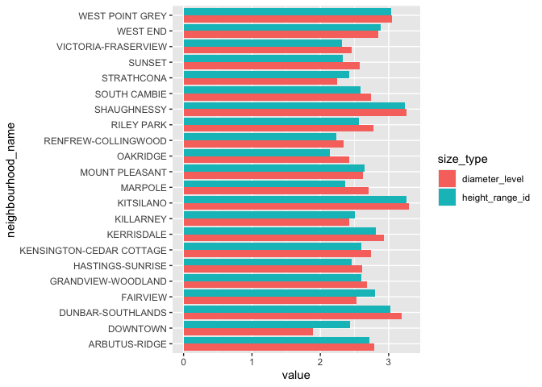<!-- --> In
general, we noticed that *height_range_id* and *diameter_level* seems to
have a linear relationship, when the trees is taller, the diameter is
greater, which makes sense. And combining with *neighbourhood_name*. We
can conclude that the neighbourhood with taller and bigger trees are

1)  West Point Grey

2)  Shaughnessy

3)  Kitsilano

4)  Dunbar

5)  Arbutus

They are mostly located in West Vancouver.

#### Research Question 4. What’s the possible factor that contributes to the **curb** variable?

##### Summarizing: Compute the *range*, *mean*, and *two other summary statistics* of **one numerical variable** across the groups of **one categorical variable** from your data.

To explor the relationship between *curb* and *street_side_name*, I
calculated **percentage** of *curb* value (“Y” or “N”) across
*street_side_name*.

``` r
vancouver_trees_stree_side_curb_percent <- vancouver_trees_sub %>% 
                                pivot_wider(names_from = curb,
                                values_from = curb,
                                values_fn = \(x)1,
                                values_fill = 0)%>%
                                group_by(street_side_name)%>%
                                summarise(across(N:Y, ~scales::percent(mean(.x), 0.01)))
head(vancouver_trees_stree_side_curb_percent)
```

    ## # A tibble: 6 × 3
    ##   street_side_name N       Y      
    ##   <chr>            <chr>   <chr>  
    ## 1 BIKE MED         0.00%   100.00%
    ## 2 EVEN             8.37%   91.63% 
    ## 3 GREENWAY         100.00% 0.00%  
    ## 4 MED              16.53%  83.47% 
    ## 5 ODD              8.75%   91.25% 
    ## 6 PARK             0.69%   99.31%

We can notice that for Greenway, the trees 100% don’t have curb, while
for others type of street_side, the trees mostly have curb.
Specifically, for Bike Road, the trees 100% have curb. It makes sense
that for normal street, the trees should come with curb, while for
Greenway the trees don’t necessarily have ones.

##### Graphing: Create a graph out of summarized variables that has at least two geom layers.

To plot the *street_side_name* and *curb_percentage* in stack for easier
comparison, I used pivot_longer() to make the data “tidier”.

``` r
vancouver_trees_stree_side_curb_percent <- vancouver_trees_stree_side_curb_percent %>% 
                            pivot_longer(c(`N`, `Y`), 
                             names_to = "curb", 
                             values_to = "value")
print(vancouver_trees_stree_side_curb_percent)
```

    ## # A tibble: 12 × 3
    ##    street_side_name curb  value  
    ##    <chr>            <chr> <chr>  
    ##  1 BIKE MED         N     0.00%  
    ##  2 BIKE MED         Y     100.00%
    ##  3 EVEN             N     8.37%  
    ##  4 EVEN             Y     91.63% 
    ##  5 GREENWAY         N     100.00%
    ##  6 GREENWAY         Y     0.00%  
    ##  7 MED              N     16.53% 
    ##  8 MED              Y     83.47% 
    ##  9 ODD              N     8.75%  
    ## 10 ODD              Y     91.25% 
    ## 11 PARK             N     0.69%  
    ## 12 PARK             Y     99.31%

``` r
vancouver_trees_stree_side_curb_percent_plot <- vancouver_trees_sub %>%
              count(street_side_name, curb) %>%       
              group_by(street_side_name) %>%
              mutate(percentage= prop.table(n) * 100) %>%
              ggplot() + aes(street_side_name, percentage, fill=curb) +
              geom_bar(stat="identity") +
              coord_flip()
print(vancouver_trees_stree_side_curb_percent_plot)
```

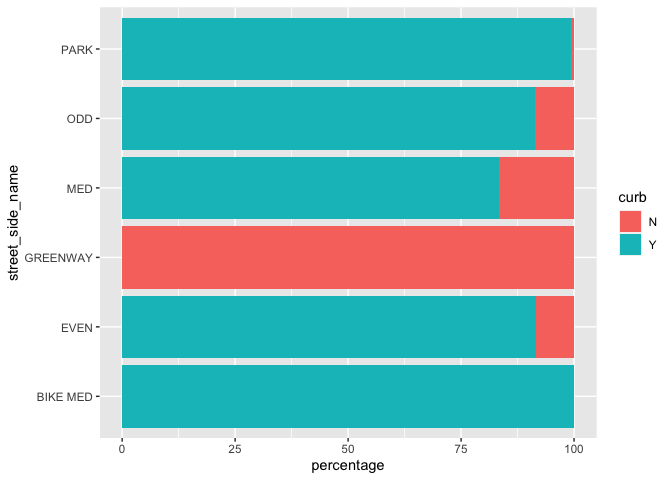<!-- -->

The graph perfectly illustrated our reasoning above in Summarize
Section.

<!----------------------------------------------------------------------------->

### 1.2 (3 points)

Based on the operations that you’ve completed, how much closer are you
to answering your research questions? Think about what aspects of your
research questions remain unclear. Can your research questions be
refined, now that you’ve investigated your data a bit more? Which
research questions are yielding interesting results?

<!-------------------------- Start your work below ---------------------------->

Based on the exploration in Task 4 above, I refined my research proposal
below:

#### Reseach Question 1. Will the number of count of planted trees change by time?

We noticed from the graph that there is a cyclic pattern of the tree
planted count by month. And 1 cycle is roughly 1 year. Specifically, the
month with larger tree planted count coincides with springtime (March to
May). While during the winter month (Nov. to Feb.), people tends to
plant less. This finding conform to our common sense.

#### Reseach Question 2. What’s the relationship between the year/month we planted the trees and its tree’s height? Is there any trend by time?

We can determine from the summary and plot that, the tree’s count of
some smaller *height_range_id*, such as 0, 1 increases, and the larger
ones, such as 2 - 6 decreases over the year. So, we can concludes that,
people tend to plant shorter tree in the recent 10 years.

#### Reseach Question 3. What’s the relationship between the neighbourhood and its tree’s size (height and diameter)? Is there any pattern, such as some neighbourhood prefer planting bigger or taller trees?

In general, we noticed that *height_range_id* and *diameter_level* seems
to have a linear relationship, when the trees is taller, the diameter is
greater, which makes sense. And combining with *neighbourhood_name*. We
can conclude that the neighbourhood with taller and bigger trees are

1)  West Point Grey

2)  Shaughnessy

3)  Kitsilano

4)  Dunbar

5)  Arbutus

They are mostly located in West Vancouver.

#### Reseach Question 4. What’s the possible factor that contributes to the **curb** variable?

We can learn from the graph that, for Greenway, the trees 100% don’t
have curb, while for others type of street_side, the trees mostly have
curb. Specifically, for Bike Road, the trees 100% have curb. It makes
sense that for normal street, the trees should come with curb, while for
Greenway the trees don’t necessarily have ones.

<!----------------------------------------------------------------------------->

### Attribution

Thanks to Icíar Fernández Boyano for mostly putting this together, and
Vincenzo Coia for launching.
